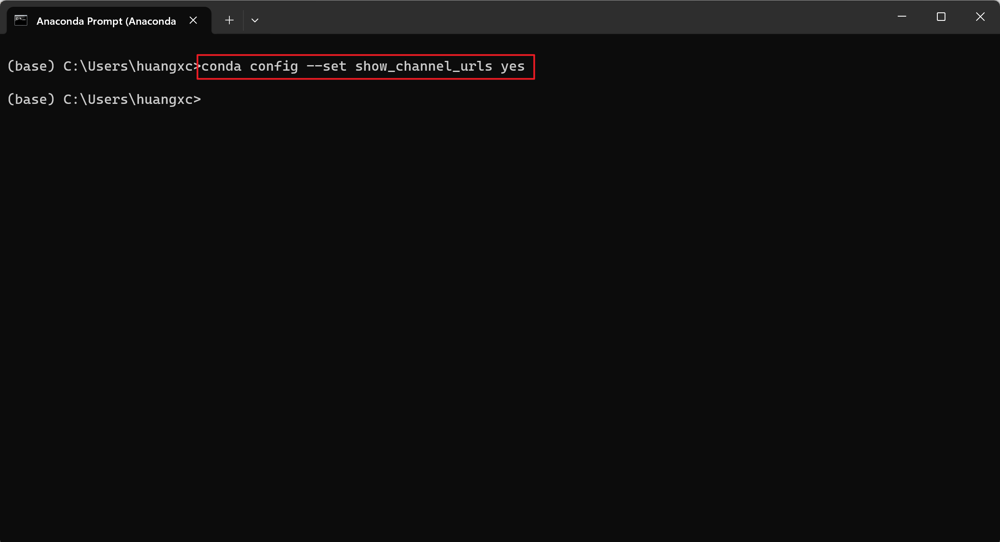

# 一、安装

## 1、下载安装包

- 推荐在[清华镜像](https://mirrors.tuna.tsinghua.edu.cn/anaconda/archive/)网站下载，速度更快

> https://mirrors.tuna.tsinghua.edu.cn/anaconda/archive/

- 也可在[官网](https://www.anaconda.com/download)下载


这里我选择在清华镜像网站下载2020.02版本的windows 64位安装包

## 2、安装选项
- 找到下载的安装包，双击运行


- 点击next


- 选择 I agree


- 选择only for me 还是for all users

​	我这里选了for all users，需要管理员权限


- 修改安装路径

我这里选择安装在D盘Anaconda3文件夹下


- 添加环境变量


- 安装完成


- 结束


# 二、换源

参考[官方教程](https://mirrors.tuna.tsinghua.edu.cn/help/anaconda/)

> https://mirrors.tuna.tsinghua.edu.cn/help/anaconda/

## Anaconda 镜像使用帮助

Anaconda 是一个用于科学计算的 Python 发行版，支持 Linux, Mac, Windows, 包含了众多流行的科学计算、数据分析的 Python 包。

Anaconda 安装包可以到 https://mirrors.tuna.tsinghua.edu.cn/anaconda/archive/ 下载。

TUNA 还提供了 Anaconda 仓库与第三方源（conda-forge、msys2、pytorch等，[查看完整列表](https://mirrors.tuna.tsinghua.edu.cn/anaconda/cloud/)，更多第三方源可以前往[校园网联合镜像站](https://mirrors.cernet.edu.cn/list/anaconda)查看）的镜像，各系统都可以通过修改用户目录下的 `.condarc` 文件来使用 TUNA 镜像源。Windows 用户无法直接创建名为 `.condarc` 的文件，可先执行 `conda config --set show_channel_urls yes` 生成该文件之后再修改。

注：由于更新过快难以同步，我们不同步`pytorch-nightly`, `pytorch-nightly-cpu`, `ignite-nightly`这三个包。

```
channels:
  - defaults
show_channel_urls: true
default_channels:
  - https://mirrors.tuna.tsinghua.edu.cn/anaconda/pkgs/main
  - https://mirrors.tuna.tsinghua.edu.cn/anaconda/pkgs/r
  - https://mirrors.tuna.tsinghua.edu.cn/anaconda/pkgs/msys2
custom_channels:
  conda-forge: https://mirrors.tuna.tsinghua.edu.cn/anaconda/cloud
  msys2: https://mirrors.tuna.tsinghua.edu.cn/anaconda/cloud
  bioconda: https://mirrors.tuna.tsinghua.edu.cn/anaconda/cloud
  menpo: https://mirrors.tuna.tsinghua.edu.cn/anaconda/cloud
  pytorch: https://mirrors.tuna.tsinghua.edu.cn/anaconda/cloud
  pytorch-lts: https://mirrors.tuna.tsinghua.edu.cn/anaconda/cloud
  simpleitk: https://mirrors.tuna.tsinghua.edu.cn/anaconda/cloud
  deepmodeling: https://mirrors.tuna.tsinghua.edu.cn/anaconda/cloud/
```

即可添加 Anaconda Python 免费仓库。

运行 `conda clean -i` 清除索引缓存，保证用的是镜像站提供的索引。

运行 `conda create -n myenv numpy` 测试一下吧。

## Miniconda 镜像使用帮助

Miniconda 是一个 Anaconda 的轻量级替代，默认只包含了 python 和 conda，但是可以通过 pip 和 conda 来安装所需要的包。

Miniconda 安装包可以到 https://mirrors.tuna.tsinghua.edu.cn/anaconda/miniconda/ 下载。

### 其他三方源

对于conda的其他三方源，如有需要请修改[anaconda.py](https://github.com/tuna/tunasync-scripts/blob/master/anaconda.py)文件，并提交pull request，我们会综合考虑多方因素来酌情增减。

---

- 首先打开anaconda prompt


- 输入命令

```perl
conda config --set show_channel_urls yes
```



- 即可在C:\Users\ "你的用户名"下找到.condarc文件


- 用记事本打开并把官方给的内容粘贴到.condarc即可


- 清除索引缓存


```
  conda clean -i
```

  
