# 一、安装CUDA

## 1、查看电脑支持的cuda版本

快捷键 win + R，然后输入 cmd

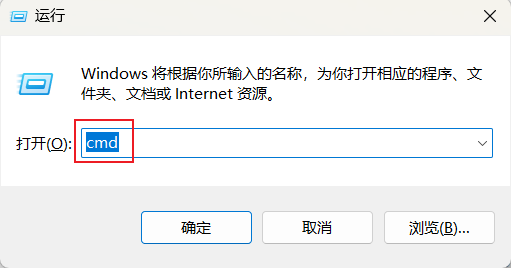

然后输入如下指令：

```
nvidia-smi
```

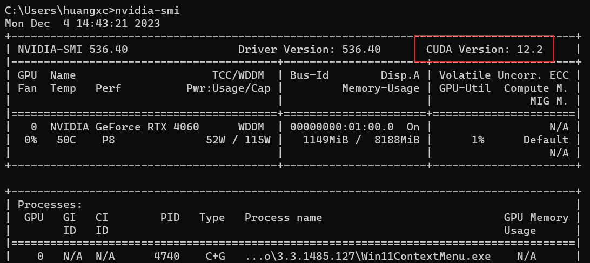

我这里最高支持12.2版本

## 2、下载安装包

在[CUDA官网](https://developer.nvidia.com/cuda-toolkit-archive)下载所需版本的CUDA

> https://developer.nvidia.com/cuda-toolkit-archive

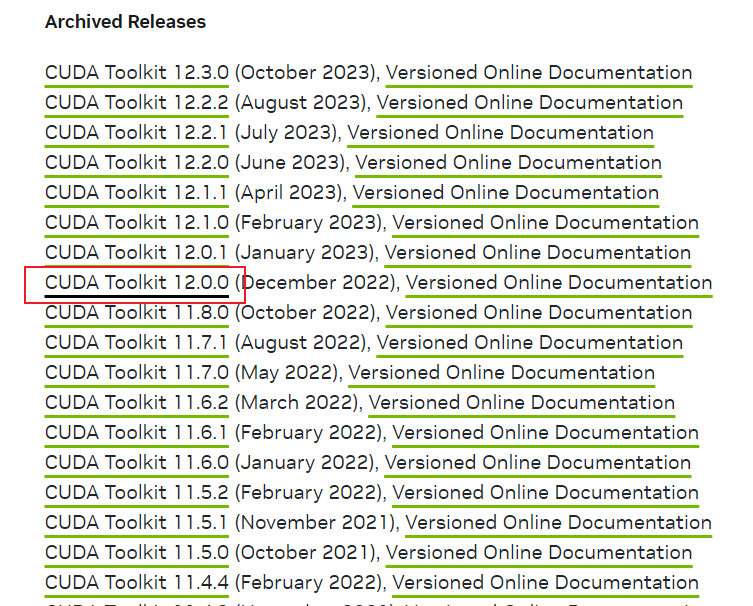

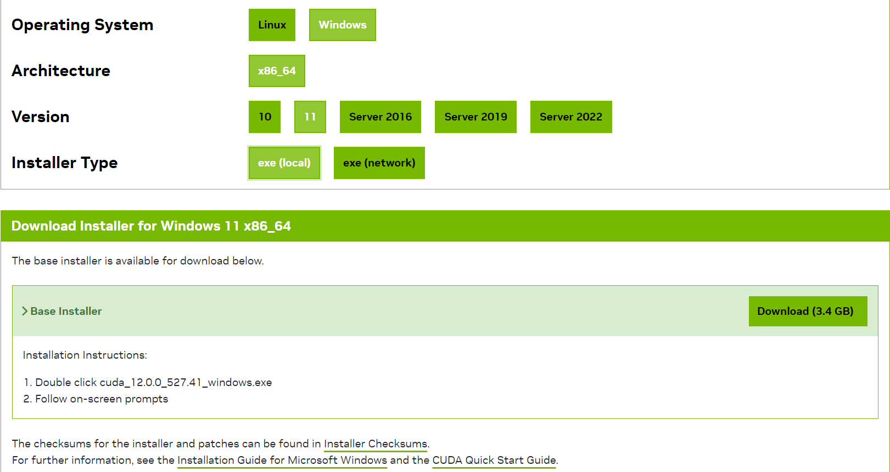

我这里选择下载12.0.0版本

## 3、安装选项

找到下载好的安装包，双击运行


选择一个临时文件存储路径等待提取

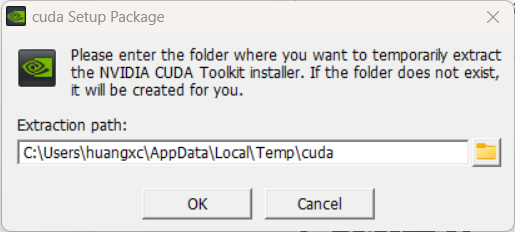

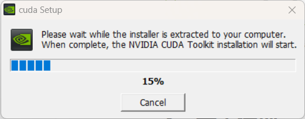

同意许可协议

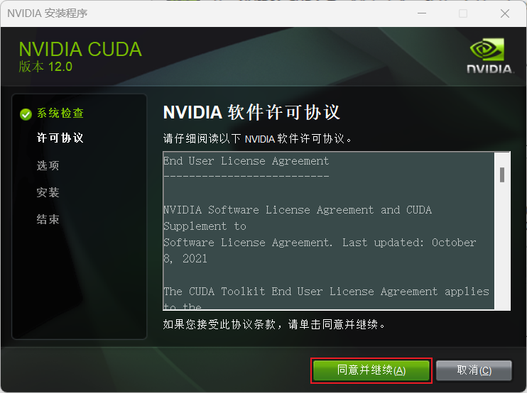

自定义安装

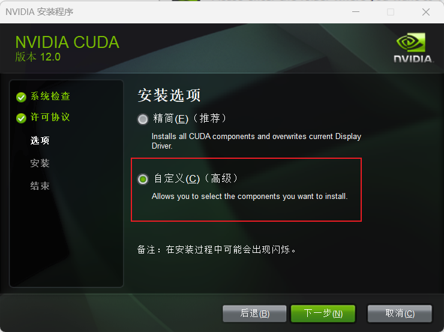

选择不安装驱动（之前已经安装过）

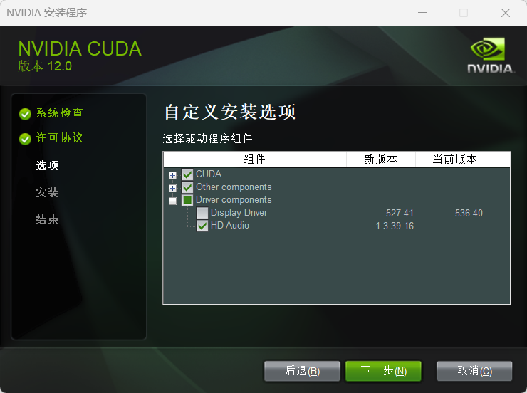

选择安装位置（我这里选择了默认）

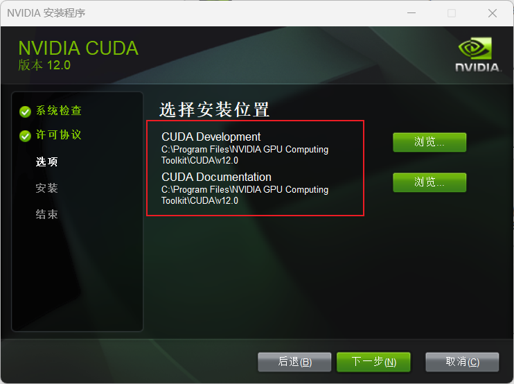

选择I undestand

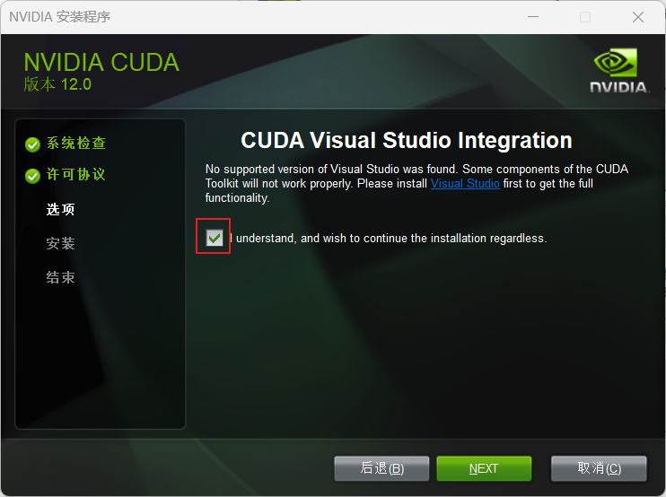

安装成功

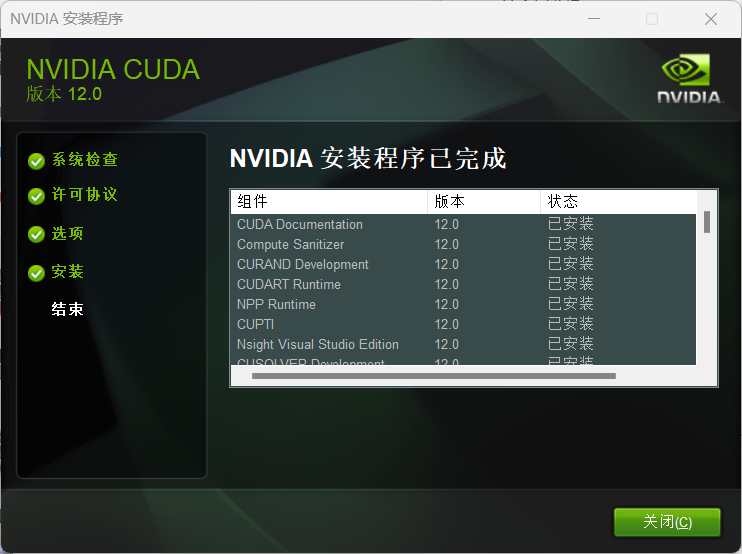

查看版本

```
nvcc -V
```

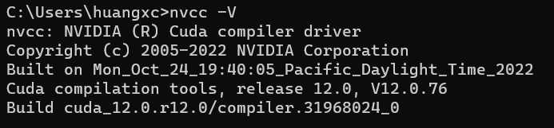

# 二、安装cuDNN

## 1、下载安装包

首先安装对应的cuDNN

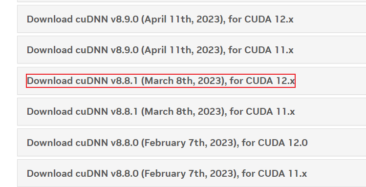

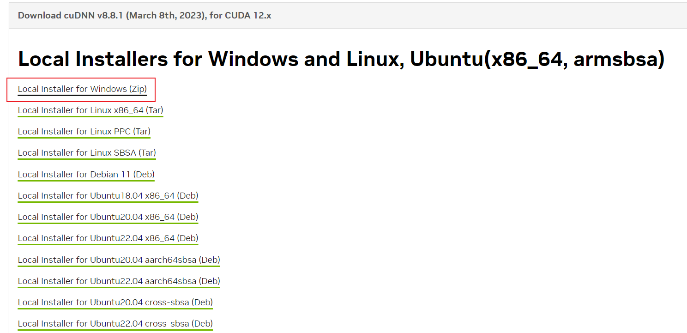

## 2、安装

找到下载的安装包，并解压

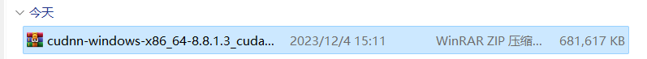

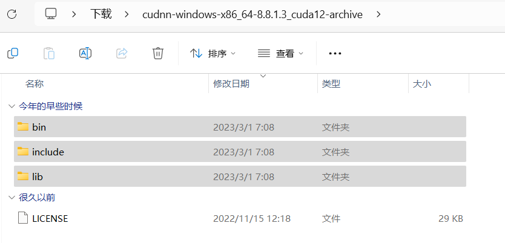

把解压后的三个文件夹复制到`C:\Program Files\NVIDIA GPU Computing Toolkit\CUDA\v12.0`（自己的安装目录）

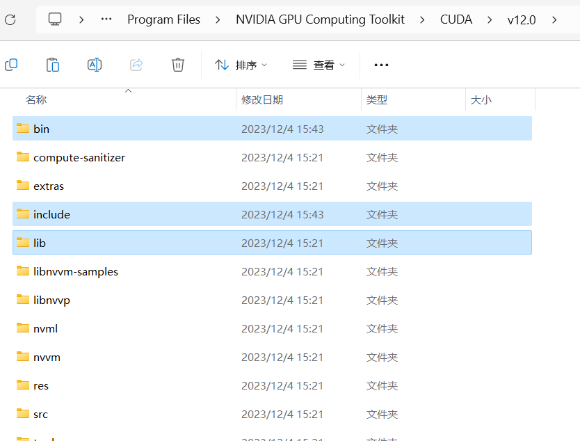

## 3、测试

在`C:\Program Files\NVIDIA GPU Computing Toolkit\CUDA\v12.0\extras\demo_suite`文件下打开终端

分别输入

```
deviceQuery.exe
bandwidthTest.exe
```


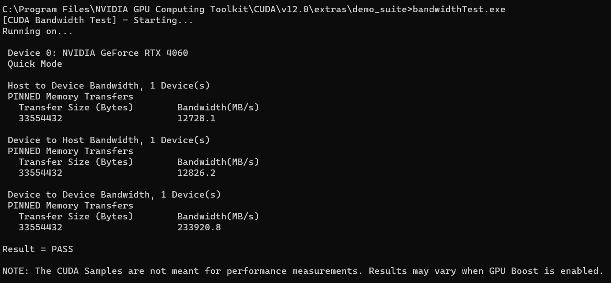

显示Result = PASS即为安装成功

